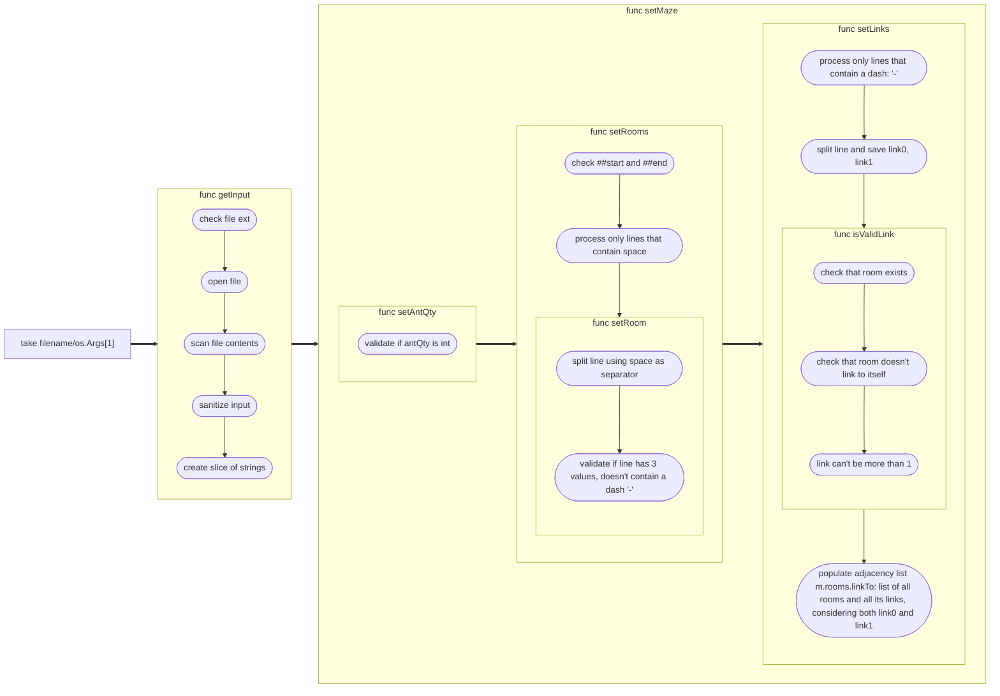

```mermaid
flowchart LR

main["take filename/os.Args[1]"] ==> getInput ==> setMaze

%% main.go > func getInput
  subgraph getInput["func getInput"]
      chkExt([check file ext]) --> open([open file]) --> scan([scan file contents]) --> sanitize([sanitize input]) --> fileIn([create slice of strings])
  end

%% setMaze.go > func setMaze
subgraph setMaze["func setMaze"]
direction LR
setAntQty ==> setRooms ==> setLinks

subgraph setAntQty["func setAntQty"]
chkAnt([validate if antQty is int])
end

subgraph setRooms["func setRooms"]
chkStartEnd([check ##start and ##end]) --> sp([process only lines that contain space]) --> setRoom

subgraph setRoom["func setRoom"]
direction TB
splitS([split line using space as separator]) --> chkValues([validate if line has 3 values, doesn't contain a dash '-'])
end

end

subgraph setLinks["func setLinks"]
dash([process only lines that contain a dash: '-']) --> splitL([split line and save link0, link1]) --> isValidLink --> adjL([populate adjacency list m.rooms.linkTo: list of all rooms and all its links, considering both link0 and link1])

subgraph isValidLink["func isValidLink"]
chkRmExists([check that room exists]) --> chkLinkToItself([check that room doesn't link to itself]) --> chkSameLink([link can't be more than 1])
end


end

end
``` 