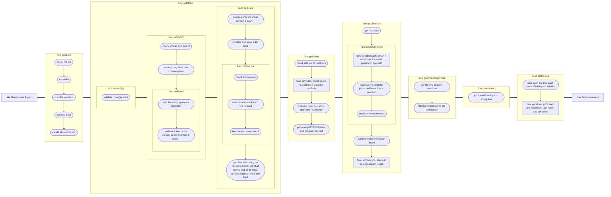
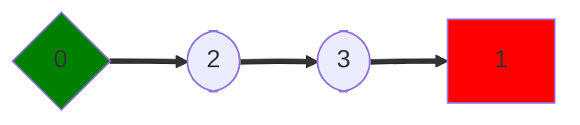
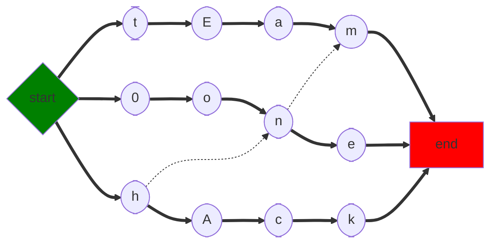
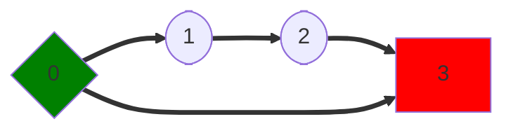
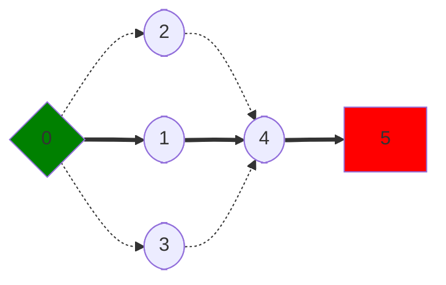
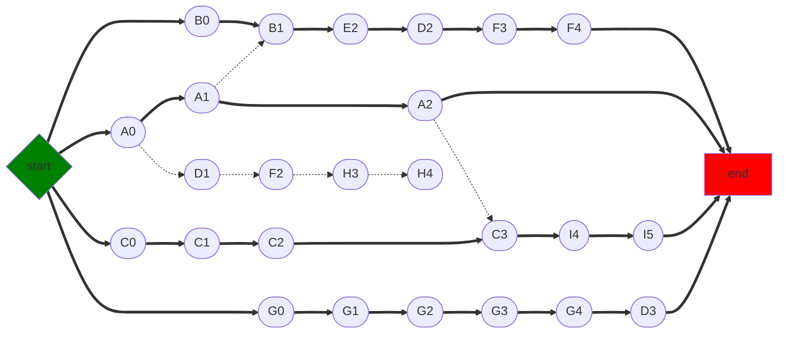

# lem-in

`lem-in` is a digital version of an ant farm. This program takes a `TXT` file that describes the ants, rooms, and links. The program then tries to find the most optimal set of paths that takes the ants from the start room to the end room in the shortest possible total turns.

## Installation

1. Make sure the following are installed in your sytem before running the program:

- [Go](https://golang.org/doc/install) (version 1.20 or later recommended)
- Git, such as [Gitea](https://01.gritlab.ax/git/), to clone the repository


2. Clone the repository by running the following code:
	
	```bash
	https://01.gritlab.ax/git/ylee/lem-in.git
	cd lem-in
	```

## Usage

You can now use the application by running the following command:

```bash
go run . <filename.txt>
```

Make sure to replace `<filename.txt>` with the specific filename of the `TXT` file you want to access. Sample `TXT` files are provided inside the `examples` directory. For example, you may access one of the examples as follows:

```bash
go run . examples/example00.txt
```

You should then see the output displayed on the terminal in the following format:

```bash
number_of_ants
the_rooms
the_links

Lx-y Lz-w Lr-o ...
```

- `x`, `z`, and `r` represent the ant numbers (going from 1 to `number_of_ants`)
- `y`, `w`, and `o` represent the room names

## Input Validity and Error Handling

- Only `TXT` files are accepted.
- The first line is considered as the number of ants and, therefore, should always be a positive integer.
- The rooms should be in the format `roomName coord_x coord_y`, and `coord_x coord_y` should always be integers; for example, `start 1 2`.
- The room names should not start with the letter `L` or with the symbol `#` and must have no spaces within it.
- There should be only one `##start` and one `##end` commands and corresponding rooms.
- The start and end rooms should not be the same.
- The links should be in the format `roomName1-roomName2`; for example, `1-2`.
- The rooms cannot link to itself; for example, `3-3` is invalid.
- A link can join two rooms only once; for example, having both `1-2` and `2-1` as links is invalid.
- Any unknown command that starts with `#` will be ignored and not included in the final output.
- Except for the start and end rooms, a room can only have one ant at a time per turn, ants cannot occupy the same room in a turn, and a link can be used only once per turn.
- An ant can move only once per turn, and the destination room should be empty.
- Unit tests are provided.

## Implementation

Here is a flowchart visually describing this `lem-in` application:



The following are flowcharts to visualize some of the provided examples:

#### example00



#### example01



#### example02



#### example03



#### example04/06/07


#### example05



#### badexample01


## Members

* [Inka Säävuori](https://github.com/Inkasaa) 👑
* [Jedi Reston](https://github.com/jeeeeedi) 🤓
* [Yuanneng Lee (Allen)](https://github.com/AllenLeeyn) 🤖