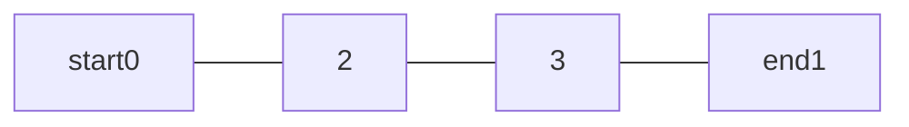
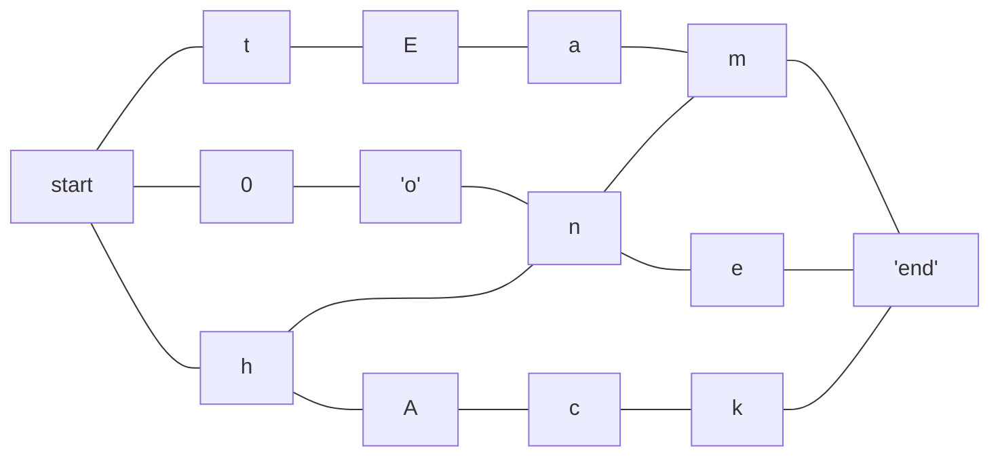
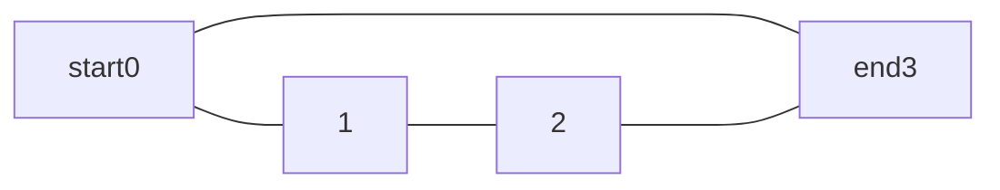
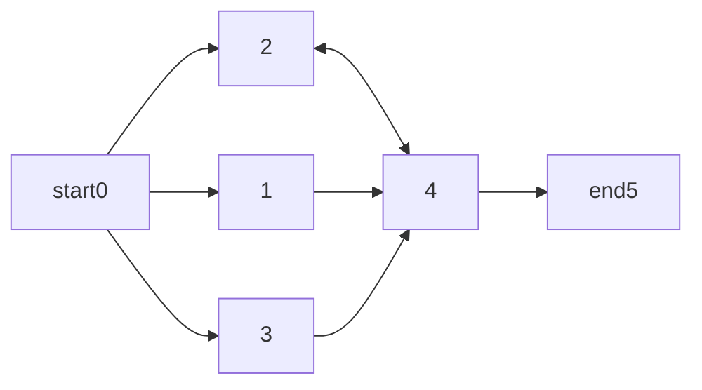
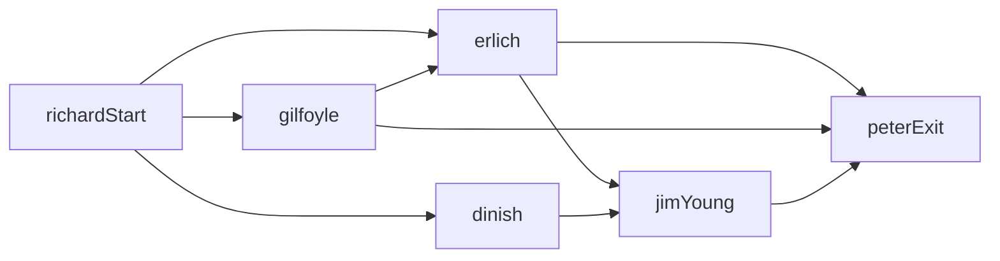
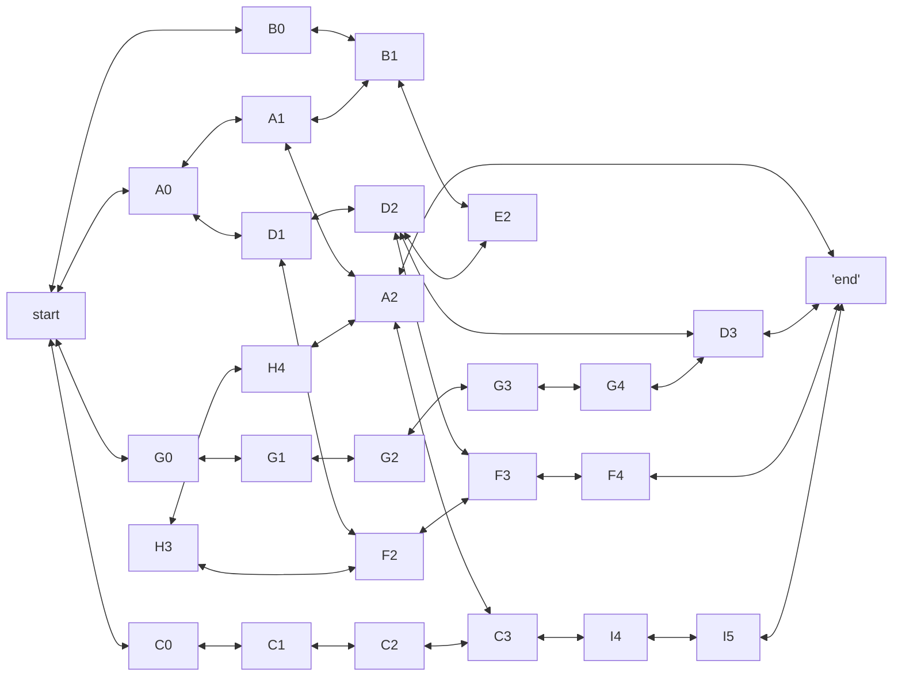

# LEM-IN

## Objective
Code a digital version of an ant farm

- read file describing the ants and the colony
- find the quickest path to get n ants across a colony (avoid traffic jams)
- only one ant can move through a link at one time (no walking over other ants)

- display:
    - content of the file passed as argument (make an ant farm with tunnels and rooms)
    - each move the ant make from room to room (look at how they find the exit)
    - standard output display format:
        ```
        number_of_ants
        the_rooms
        the_links

        Lx-y Lz-w Lr-o ... // ants move at each turn
        ```
        - x,z, r represents the ant number
        - y,w, o represents the rooms names
        - rooms are defined by `name coord_x coord_y`
         - coordinates of room will be int
        - links are defined by `name1-name2`

- all ants start in the room ##start
- bring them to the room ##end as few moves as possible

- ERROR: invalid data format
    - rooms that link to themselves
    - too many/ too few ants
    - no ##start/ ##end
    - duplicated rooms
    - link to unkwnons rooms
    - room with invlid coorediates
    - a variety of invalid or poorly formatted input
    - A room will never start with the letter L or with # and must have no spaces
    - two rooms can't have more than one tunnel connecting them
    - each room can contain only one ant at a time

## Task
- read file
- validate input
 - get number of ants
 - get rooms
- map out rooms and links/ tunnels (?)

#### example00

#### example01


#### example02


#### example03


#### example04


#### example05

