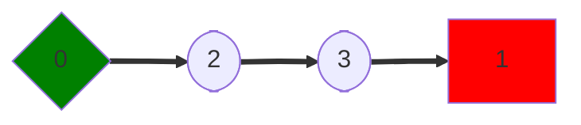
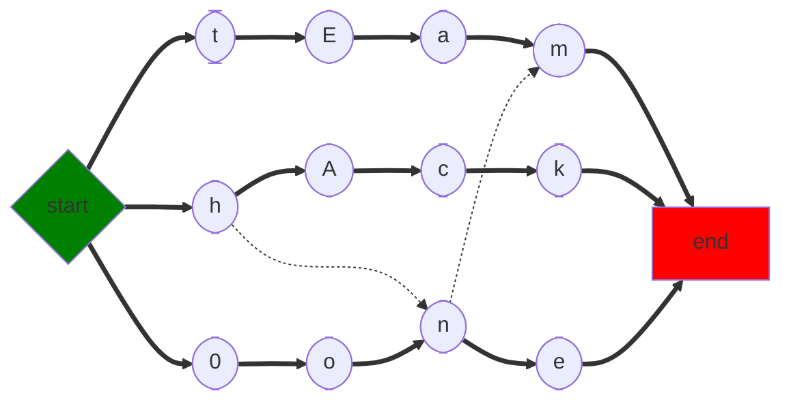
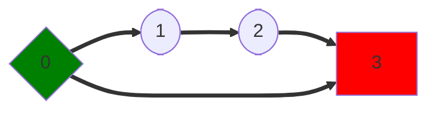
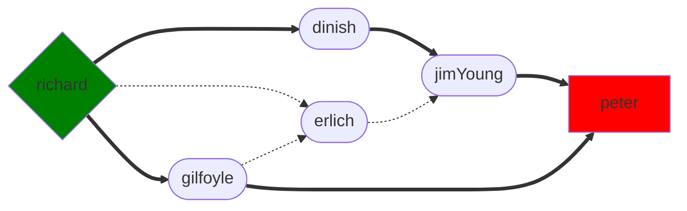
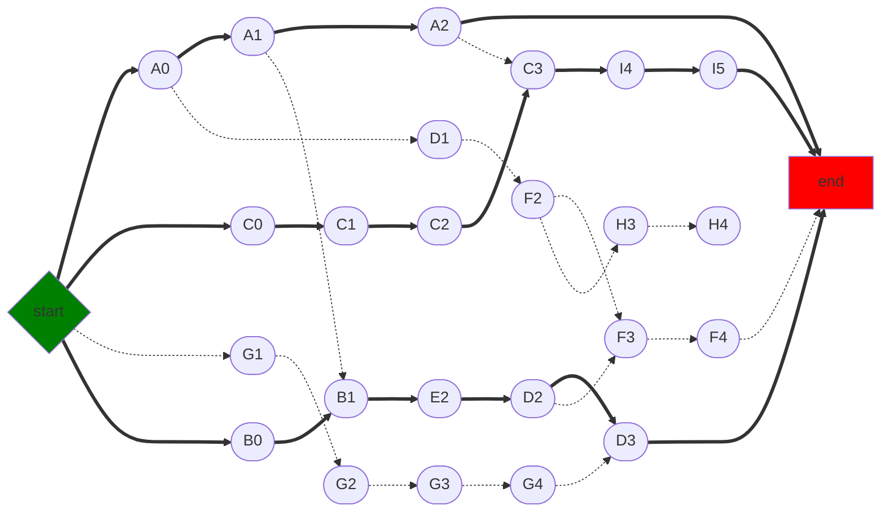
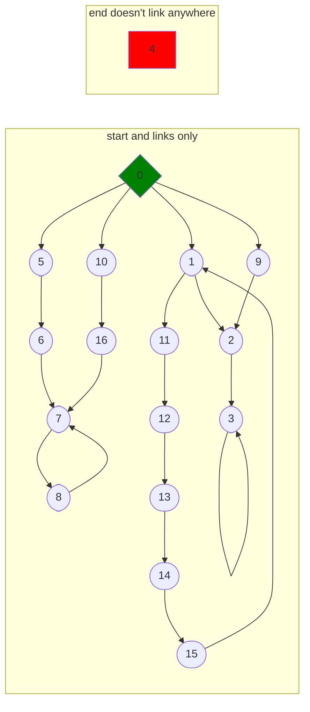

# lem-in

## Objective

This `lem-in` project is a digital version of an ant farm. The goals of the program are as follows:

- read file describing the ants and the colony
- find the quickest path to get _n_ ants across a colony (avoid traffic jams)
- only one ant can move through a link at one time (no walking over other ants)
- display the following:
  - content of the file passed as argument (make an ant farm with tunnels and rooms)
  - each move the ant makes from room to room (look at how they find the exit)
  - standard output display format:

    ```bash
    number_of_ants
    the_rooms
    the_links

    Lx-y Lz-w Lr-o ... // ants move at each turn
    ```

    - x, z, r represent the ant number
    - y, w, o represent the room names
    - rooms are defined by `name coord_x coord_y`
    - coordinates of the rooms are always in `int`
    - links are defined by `name1-name2`

- all ants start in the room ##start
- bring them to the room ##end as few moves as possible

- ERROR: invalid data format
  - rooms that link to themselves
  - too many/ too few ants
  - no ##start/ ##end
  - duplicated rooms
  - link to unknown rooms
  - room with invalid coordinates
  - a variety of invalid or poorly formatted input
  - A room will never start with the letter _L_ or with _#_ and must have no spaces
  - two rooms can't have more than one tunnel connecting them
  - each room can contain only one ant at a time

## Task

- read file (Jedi)
- validate input (Jedi)
- get number of ants (Jedi)
- get rooms (Jedi)
- map out rooms and links/tunnels (?)

#### example00



#### example01



#### example02



#### example03


#### example04/06/07



#### example05



#### badexample01

