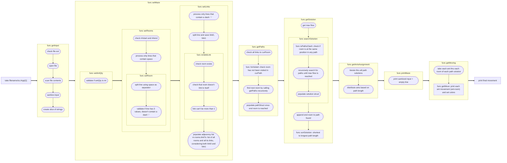

```mermaid
flowchart LR

main["take filename/os.Args[1]"] ==> getInput ==> setMaze ==> getPaths ==> getSolution ==> getAntsAssignment ==> printMaze ==> getMoving ==> printMovement[print final movement]

%% main.go > func getInput
  subgraph getInput[func getInput]
      chkExt([check file ext]) --> open([open file]) --> scan([scan file contents]) --> sanitize([sanitize input]) --> fileIn([create slice of strings])
  end

%% setMaze.go
subgraph setMaze[func setMaze]
direction LR
setAntQty ==> setRooms ==> setLinks

    subgraph setAntQty[func setAntQty]
    chkAnt([validate if antQty is int])
    end

    subgraph setRooms[func setRooms]
    chkStartEnd([check ##start and ##end]) --> sp([process only lines that contain space]) --> setRoom

        subgraph setRoom[func setRoom]
        direction TB
        splitS([split line using space as separator]) --> chkValues([validate if line has 3 values, doesn't contain a dash '-'])
        end

    end

    subgraph setLinks[func setLinks]
    dash([process only lines that contain a dash: '-']) --> splitL([split line and save link0, link1]) --> isValidLink --> adjL([populate adjacency list m.rooms.linkTo: list of all rooms and all its links, considering both link0 and link1])

        subgraph isValidLink[func isValidLink]
        chkRmExists([check room exists]) --> chkLinkToItself([check that room doesn't link to itself]) --> chkSameLink([link can't be more than 1])
        end

    end

end

%% getPaths.go
subgraph getPaths[func getPaths]
chkAllLinks([check all links to curRoom]) --> isVisited --> recursivGetPath([find next room by calling getPaths recursively]) --> pathStruct([populate pathStruct once end room is reached])

    subgraph isVisited[func !isVisited: check room has not been visited in curPath]
    end

end

%% getSolution.go
subgraph getSolution[func getSolution]
getFlow([get max flow]) --> searchSolution --> appendEnd([append end room to path found]) --> sortSolution

    subgraph searchSolution[func searchSolution]
    direction TB
    isPathsClash --> recursivSearchSol([recursively search for paths until max flow is reached]) --> solStruct([populate solution struct])
    
        subgraph isPathsClash[func isPathsClash: check if room is at the same position in any path]
        end

    end

    subgraph sortSolution[func sortSolution: shortest to longest path length]
    end

end

%% getMoving.go
subgraph getAntsAssignment[func getAntsAssignment]
iterateSolPath([iterate thru all path solutions]) --> assignAnts([distribute ants based on path length])
end

subgraph printMaze[func printMaze]
printInput([print sanitized input + empty line])
end

subgraph getMoving[func getMoving]
iterateSolPathRms([take each ant thru each room of each path solution]) --> getMove

    subgraph getMove["func getMove: print each ant movement (ant-room) and set colors"]
    end

end


``` 
